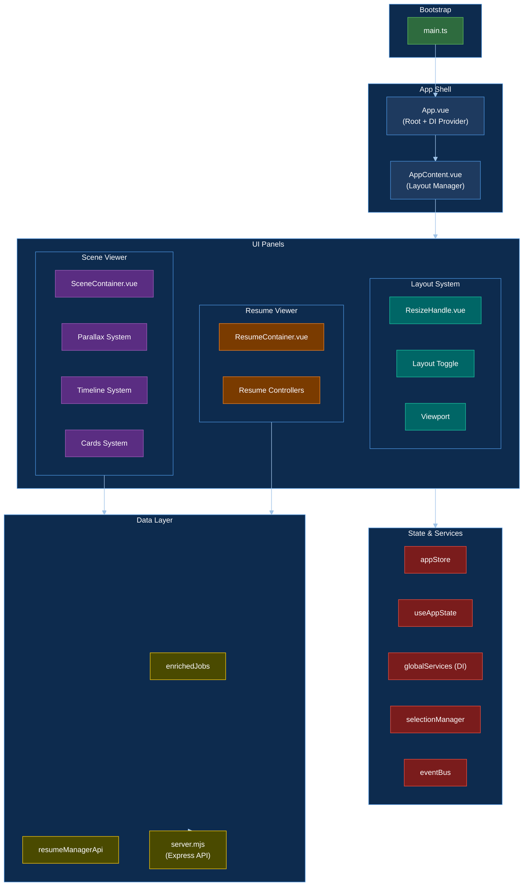
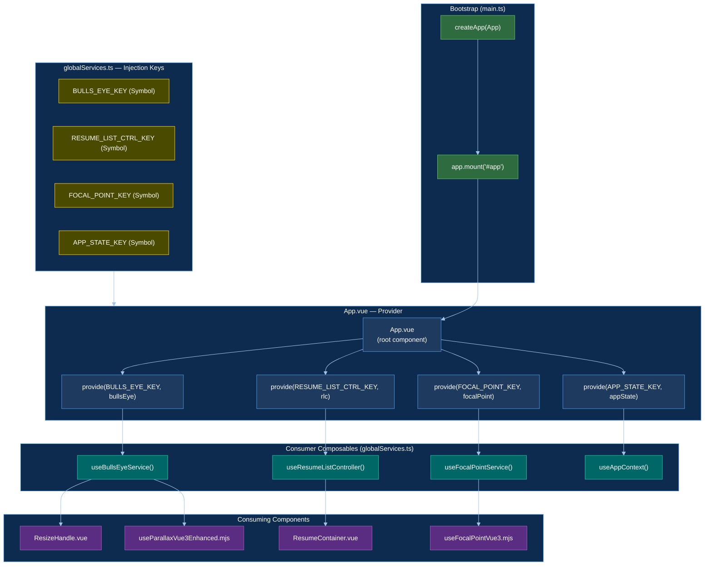
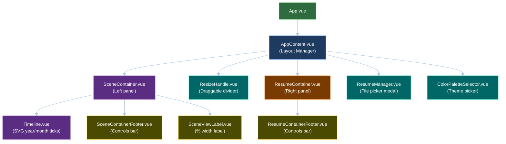
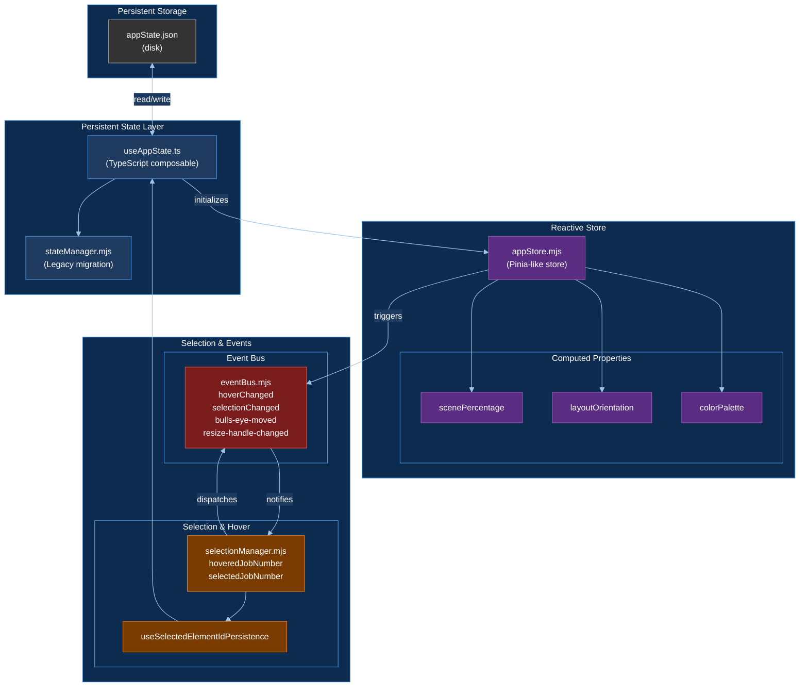
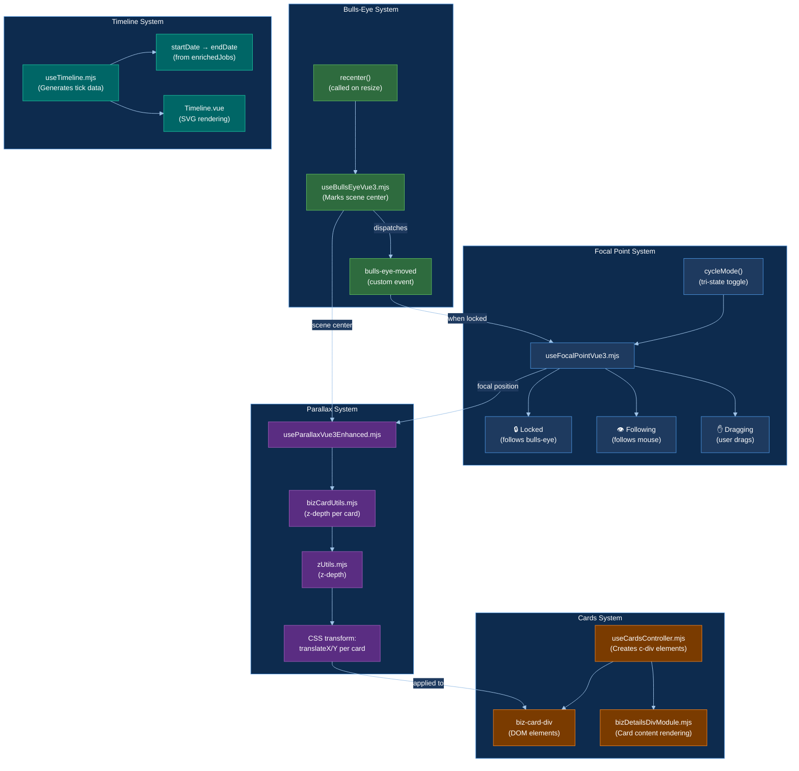
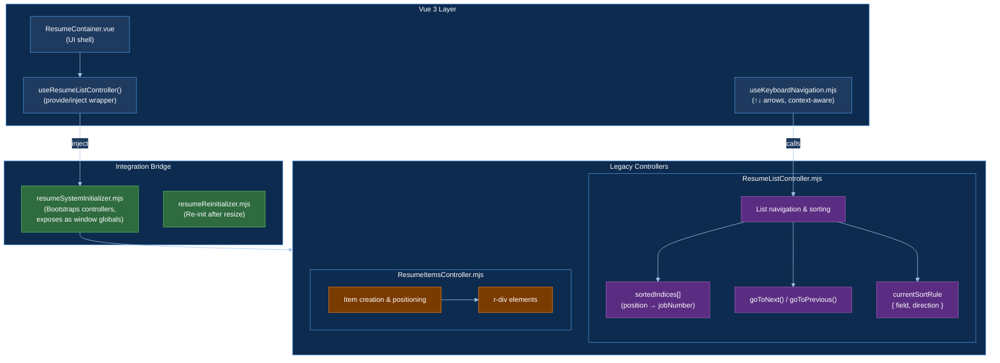
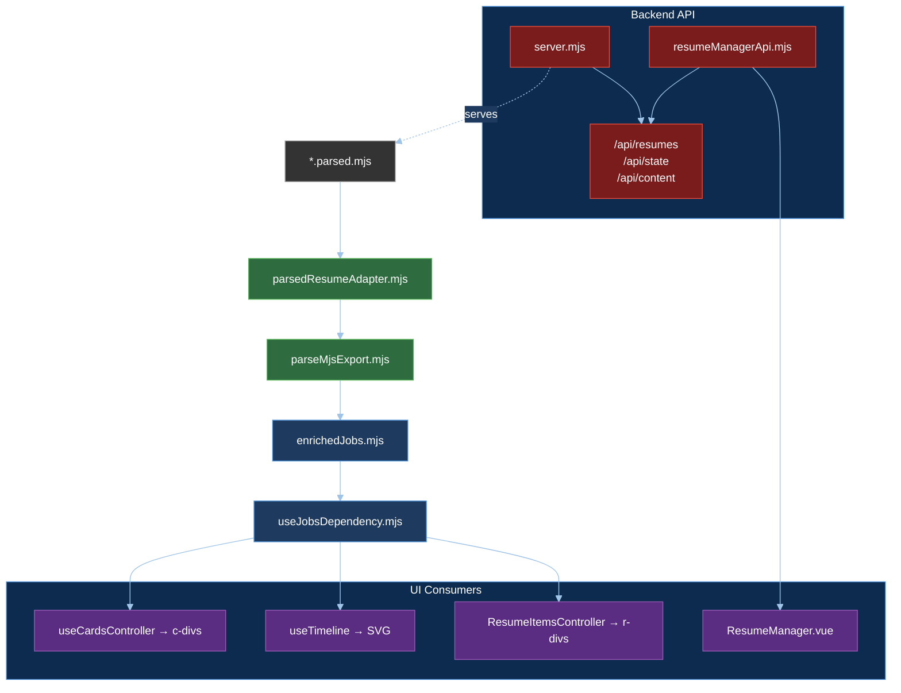
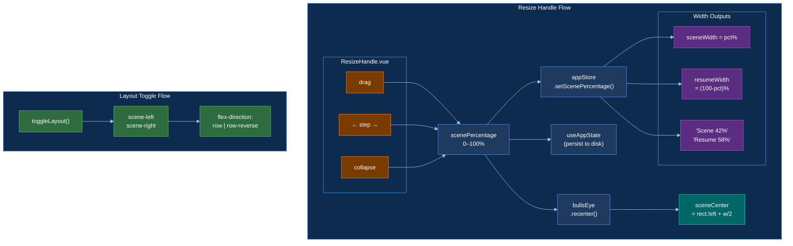

# Resume-Flock Vue Architecture

This document breaks the application into 8 logical subsections, each with its own diagram, plus a top-level diagram that ties them all together.

---

## 1. Top-Level Overview

All major systems and how they interconnect.

---

## 2. App Bootstrap & Dependency Injection

How the app initializes and wires up services via Vue 3 provide/inject.

---

## 3. Vue Component Tree

Parent-child relationships between all Vue components.

---

## 4. State Management & Services

How state is stored, shared, and synchronized across the app.

### Application vs content (separation)

Application state and content were not cleanly separated in the original design. The following separation is now explicit:

| | **Application** | **Content** |
|---|-----------------|-------------|
| **Stored** | `app_state.json` only | Loaded/reloaded in memory; not persisted as content |
| **Scope** | App shell, layout, and user choices | The resume’s data and the DOM built from it |
| **Examples** | bullsEye, focalPoint, resumeListing, colorPalette, timeline, resizeHandle and their parent elements; `currentResumeId`, `selectedJobNumber`, layout split, theme | `window.resumeFlock.allDivs`: bizCardDivs, skillCardDivs, bizResumeDivs, skillResumeDivs |
| **Lifecycle** | Persisted across sessions; survives reload | Built when a resume is loaded (initial or manager load); replaced when the resume changes |

Application = *how* the app is set up and what the user has selected. Content = *what* is shown for the current resume (jobs, cards, list items). Content is derived from the resume payload and from `allDivs`; the raw content is not stored in `app_state.json`.

**Content updates app elements (not saved in app_state):** After a new resume is loaded, some app elements must be updated so they cover only the extent of the resume data — e.g. timeline start/end and height, scene view container height (`useTimeline` / `computeBoundsFromJobs`, etc.). Those content-derived bounds are used only to update layout in memory; they are not persisted in `app_state.json`. Card geometry (positions, sizes) is never persisted anywhere: cards are positioned randomly on each resume load.

### Audit: what lives in app_state.json

A pass over the codebase confirms the following:

| What is persisted | Where | Classification |
|-------------------|--------|----------------|
| `currentResumeId`, `selectedJobNumber`, `selectedElementId`, `selectedDualElementId`, `lastVisitedJobNumber` | user-settings | **Application** — selection and which resume is active |
| `layout` (orientation, scenePercentage), `resizeHandle.stepCount`, `focalPoint` (mode/position) | user-settings | **Application** — layout and shell preferences |
| `theme` (colorPalette, borderSettings, etc.) | user-settings | **Application** — visual preferences |
| `resume.sortRule` | user-settings / legacy AppState.resume | **Application** — list sort preference |
| `scrollPositions` (sceneContentScrollTop, resumeContentScrollTop) | user-settings | **Application (view/session)** — scroll position of panels; acceptable as session state |
| `system-constants` (zIndex, cards, timeline, etc.) | system-constants | **Application** — app configuration |

**Not in app_state (correct):** Job data, bizCardDivs, skillCardDivs, bizResumeDivs, skillResumeDivs, any div references or payloads. These live in memory and in `window.resumeFlock.allDivs` and are loaded/reloaded with the resume.

**In-memory only (content-related, not persisted):** `removedJobNumbers` / `dismissedJobNumbers` (which jobs the user hid from the listing via the red X) live only on the controllers and are reset when the resume changes. If we ever persist “hidden jobs” per resume, that should be a per-resume content preference (e.g. alongside the resume or a separate content-level store), not in `app_state.json`.

**Note:** Selection and sort are still written via both the legacy `stateManager` (`AppState`, `saveState`) and the Vue `useAppState` path. Both write to the same backend (`/api/state`). Unifying on a single persistence path is a separate cleanup.

### How hard is it to implement this separation?

**Already in place:** Content is not persisted in app_state. Job data and divs live in memory and in `window.resumeFlock.allDivs`; timeline/scene bounds and card geometry are computed per load and not saved. So the separation (content vs app state) is largely implemented.

**Remaining work (optional / cleanup):**

| Task | Effort | What |
|------|--------|------|
| Unify persistence to one path | **Medium** | Migrate `selectionManager` and `ResumeListController` off legacy `AppState` / `saveState` so only `useAppState` (and its shape) writes to `/api/state`. Requires passing an update/save callback into the managers or loading them with the same state source. |
| Single source of truth for loaded state | **Low–medium** | Have app load state once (e.g. via `useAppState`) and feed `selectedJobNumber`, `resume.sortRule` etc. into legacy code, instead of legacy and Vue both reading/writing. |
| Stop persisting scroll positions | **Low** | If you want app_state to be strictly “user preferences” only, stop writing `scrollPositions`; keep them in memory for the session. |
| Audit that no content is ever written | **Low** | Grep for any `saveState`/`updateAppState` that could write job data, div refs, or content-derived bounds; add a short comment or guard where state is merged. |

**Summary:** The separation is already enforced in practice (no content in app_state). Making it strict and removing the dual persistence path is medium effort; the rest is low-effort polish.

---

## 5. Scene Viewer System

The parallax card scene: bulls-eye, focal point, parallax transforms, and timeline.

---

## 6. Resume Viewer System

Resume list rendering, infinite scrolling, navigation, and legacy controller integration.

---

## 7. Data Pipeline

How resume data flows from source files through enrichment to UI consumers.

---

## 8. Layout System

How the resize handle, layout toggle, and viewport work together to control the split-panel UI.

